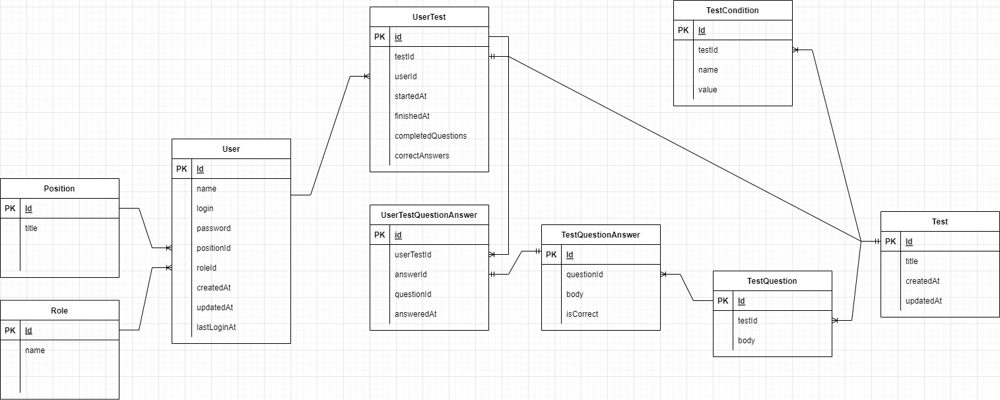
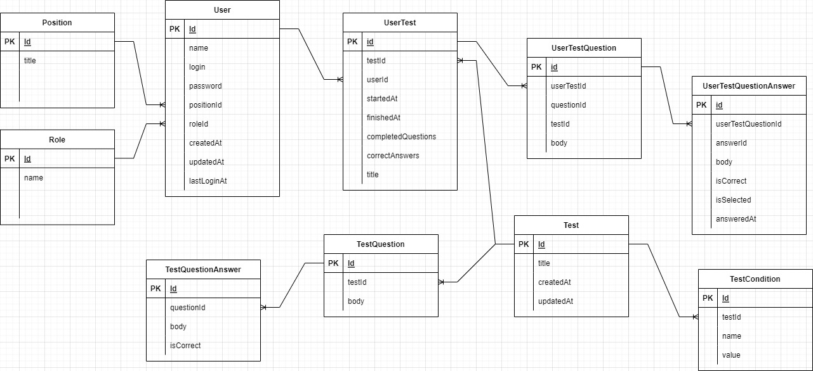

# employee-testing-app

## Swagger Rest API
#### https://app.swaggerhub.com/apis/aleksey-pavlov/employee-testing-app/1.0

## Database scheme

## Database sheme v2
#### Второй вариант предполагает копирование во время старта теста в таблицы с привязкой к юзеру. Такой вариант позволяет удалить оригинальный тест
#### Плюсы: сохраняется инфа по тесту на момент старта, во время теста можно работать только с таблицами UserTest не дергая оригиналы
#### Минусы: происходит дублирование данных

